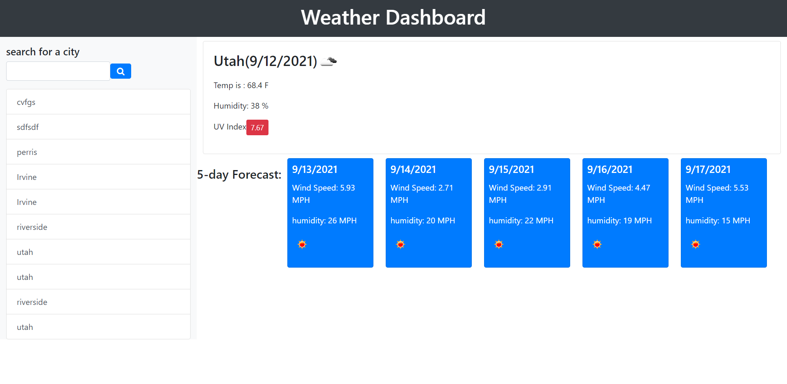

Weather Dashboard

## Table of Contents:

- [Description](#description)
- [Installation](#installation)
- [Usage](#usage)
- [License](#license)
- [Contributors](#contribute)
- [Tests](#tests)
- [Questions](#questions)

## Description

Its purpose is to generate the current and future weather of a city a user inputs in the search bar (5-days a head)

## Installation:

To install necessary dependecies, open console and run the following:

N/A

## Usage:

it is free

## License:

This is licensed under:

None

## Contributors:

none

## Tests:

In order to test, open console and run the following:

N/A

## Question:

If you have any questions contact me on [GitHub](raguayo101) or contact
Rodrigo Aguayo at rodrigoaguayo94@gmail.com
